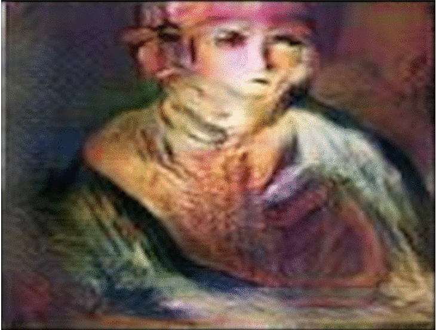

# GSoC 2025 — ArtExtract: Neural Networks for Artworks

## Evaluation Test Submission

This repository contains the solutions for the ArtExtract evaluation tasks for GSoC 2025 @ HumanAI Umbrella Organization.

---

## Task 1: Convolutional-Recurrent Architectures

**Objective**: Train a CNN-RNN hybrid model on the WikiArt dataset for multi-label art classification (style, artist, genre).

### Architecture

- **Backbone**: ResNet-50 (ImageNet-pretrained, partially frozen)
- **Sequential Processor**: 2-layer Bidirectional LSTM (hidden_dim=512)
- **Attention**: Learned spatial attention over 49 spatial positions
- **Heads**: 3 independent MLP classification heads (style, artist, genre)

*GradCAM-style attention heatmaps showing which regions of paintings the model focuses on during classification.*

### Results

| Task   | Top-1 Accuracy | Top-3 Accuracy | Top-5 Accuracy |
|--------|---------------|---------------|---------------|
| Style  | 80.5%         | ~95%          | ~97%          |
| Artist | 78.6%         | ~92%          | ~95%          |
| Genre  | 77.4%         | ~97%          | ~99%          |

### Files

| File | Description |
|------|-------------|
| `ArtGAN/model.py` | ConvRNNHybrid model architecture (ResNet-50 + BiLSTM + Attention) |
| `ArtGAN/train.py` | Training pipeline with differential LR, mixed precision, early stopping |
| `ArtGAN/evaluate.py` | Comprehensive evaluation (precision/recall/F1, confusion matrices, outliers) |
| `ArtGAN/data_loader.py` | WikiArt multi-label dataset loader with augmentation |
| `ArtGAN/strategy_discussion.md` | Strategy discussion — approach selection and design decisions |
| `ArtGAN/strategy_report.md` | Detailed evaluation report — metrics analysis and outlier findings |
| `ArtGAN/colab_training.ipynb` | Google Colab notebook for full training & evaluation pipeline |
| `ArtGAN/ICIP-16/` | Reference architecture from ICIP 2016 paper (source of the original ArtGAN baseline) |

---

## Task 2: Similarity

**Objective**: Build a model to find similarities between paintings using the National Gallery of Art Open Data.

### Architecture

- **Feature Extractor**: ResNet-50 → 2048-dim L2-normalized embeddings
- **Similarity Metric**: Cosine similarity (dot product on normalized vectors)
- **Dataset**: National Gallery of Art Open Data (498 paintings)

### Results

| Metric | Value |
|--------|-------|
| NN Similarity (mean) | 0.636 |
| Random Similarity (mean) | 0.245 |
| NN / Random Ratio | **2.6x** |
| Precision@1 | **99.0%** |
| Precision@5 | **98.6%** |
| Precision@20 | **98.4%** |

> **Note on dataset**: The NGA Open Data dataset is primarily catalogued under institutional attribution ("National Gallery of Art" or "Anonymous") rather than individual named artists. This is a known characteristic of the dataset. Evaluation uses both embedding-based analysis (NN/Random ratio) and artist-based Precision@k where labels are available.

### Files

| File | Description |
|------|-------------|
| `Similarity/feature_extractor.py` | ResNet-50 embedding extraction |
| `Similarity/similarity_search.py` | Cosine similarity search engine with visualization |
| `Similarity/evaluate_similarity.py` | Precision@k, Recall@k, mAP evaluation metrics |
| `Similarity/strategy_discussion.md` | Strategy discussion — approach selection and design decisions |
| `Similarity/colab_similarity.ipynb` | Google Colab notebook (full pipeline with outputs) |

---

## How to Run

### Task 1 (Google Colab)

1. Open `ArtGAN/colab_training.ipynb` in Colab with T4 GPU
2. Upload `WikiArt Dataset.zip` to Colab
3. Run all cells

### Task 2 (Google Colab)

1. Open `Similarity/colab_similarity.ipynb` in Colab with T4 GPU
2. Run all cells (dataset downloads automatically from NGA Open Data)

---

## Environment

- Python 3.10+
- PyTorch 2.x
- torchvision, scikit-learn, matplotlib, seaborn, pandas, tqdm, Pillow
